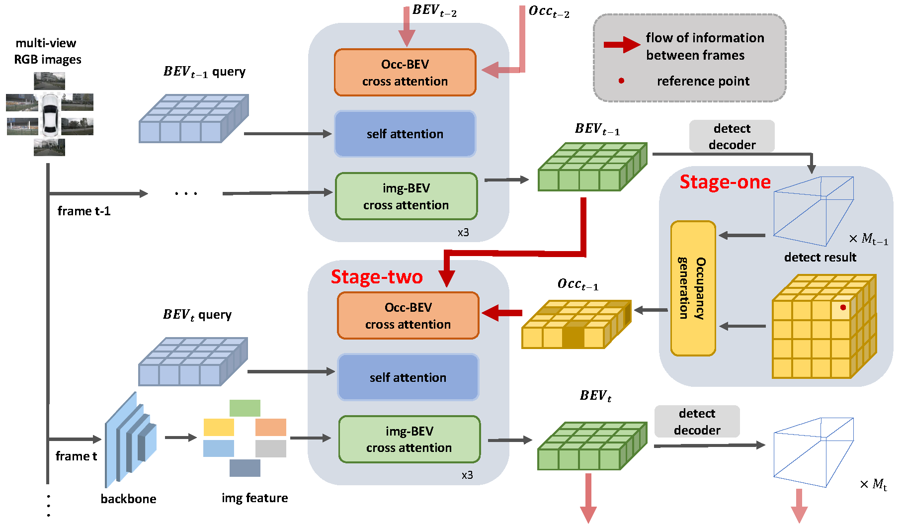

   
  
# OccTr: A Two-stage BEV Fusion Network \\for Temporal Object Detection

# Abstract
We propose a framework called OccTr, which is based on the idea that back-end detection 
results of the previous frame assist temporal fusion between frames. Briefly, OccTr is 
inspired by occupancy grid maps. It uses the detection results to generate occupancy map 
online, then interact with BEV feature to provide location information for temporal fusion. 
To this end, we designed the occupancy map generation module to convert the detect 3D bounding 
box into a pattern that can interact with BEV features; we designed the cross-attention-based feature fusion module to explore the fusion of high-resolution occupancy maps with low-resolution BEV features. Our work combines two temporal cues, intermediate representations and back-end results, to alleviate the lack of location information in image features. Our method achieves NDS metric 37.35$\%$ on the nuScenes test set, which is 1.94 percentage points higher than the baseline, confirming that occupancy information can effectively assist temporal fusion in BEV space.
# Methods

# Getting Started
- [Installation](docs/install.md) 
- [Prepare Dataset](docs/prepare_dataset.md)
- [Run and Eval](docs/getting_started.md)
